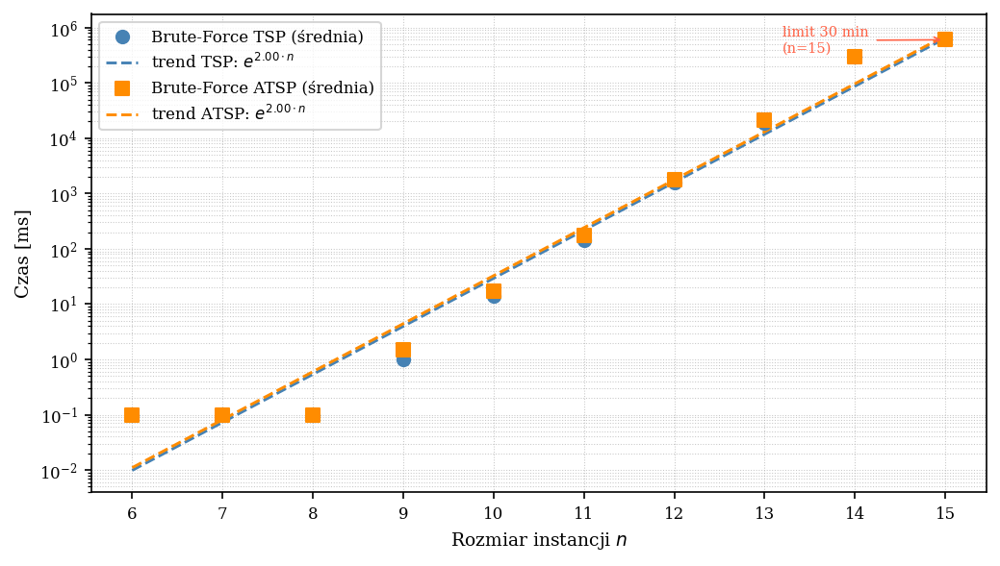
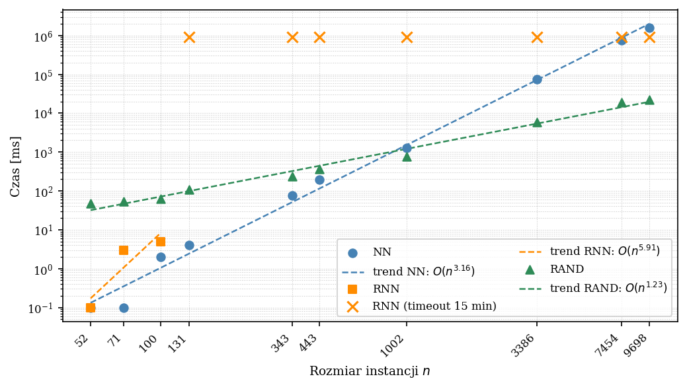
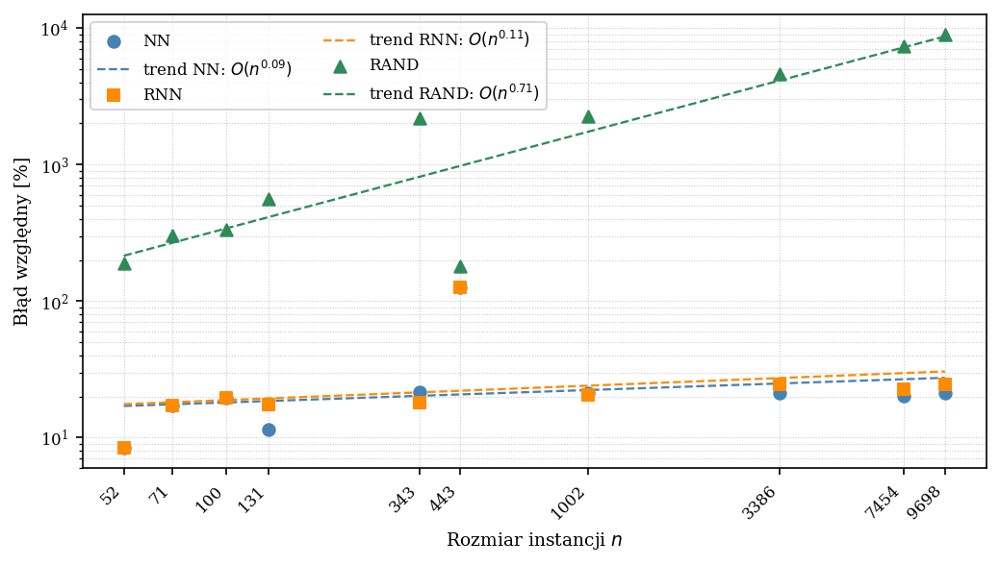

# TSP Algorithms Analysis

---

## 1. Task Description

The task involved implementing four algorithms to solve the **Traveling Salesperson Problem (TSP)**:

- **Brute-Force (BF)** – exhaustive search
- **RAND** – random algorithm
- **NN** – nearest neighbour
- **RNN** – repeated nearest neighbour

For each algorithm, the following were evaluated:

- Computational complexity
- Execution time as a function of instance size
- Relative error compared to the optimal solution

All four methods were compared in terms of solution quality, maximum instance size solvable in reasonable time (30 minutes for BF and RAND, 15 minutes for NN and RNN), and suitability for computing an upper bound (UB) for TSP solutions.

---

## 2. Methods Description

The TSP problem requires finding the shortest route visiting all cities exactly once and returning to the starting point. Cities are treated as graph vertices, and distances as edge weights. Two cases are considered:

- **Symmetric TSP (STSP)** – distance between two cities is the same in both directions
- **Asymmetric TSP (ATSP)** – distances may differ

### 2.1 Brute-Force (BF)

Checks all possible city permutations and selects the route with minimum cost. With a fixed starting city, the number of analyzed routes is \((n-1)!\). Always finds the optimal solution but is impractical for larger instances due to \(O(n!)\) complexity.

### 2.2 RAND

Generates random routes repeatedly and stores the best one. Operates very quickly but does not guarantee optimality; solution quality depends on iteration count.

### 2.3 NN (Nearest Neighbour)

Builds a route step by step, choosing the nearest unvisited city each time. Fast, but local decisions can lead to suboptimal routes. In the implementation, it is run from all starting cities, and the best result is selected.

### 2.4 RNN (Repeated NN)

Extension of NN run from multiple starting points and handling weight ties via DFS. Improves NN results for smaller instances but can become impractical for \(n \ge 131\) due to combinatorial explosion.

---

## 3. Algorithm Details

### 3.1 RAND

1. Create initial sequence [0,1,...,n-1]
2. Randomly shuffle cities (city 0 always first)
3. Compute tour cost
4. Update best result if cost is lower
5. Stop when iteration or time limit is reached

### 3.2 NN (Nearest Neighbour)

1. Select starting city
2. Mark starting city as visited
3. Repeat:
    - Choose nearest unvisited city
    - Move to it and mark as visited
4. Return to starting city after visiting all cities

### 3.3 RNN (Repeated Nearest Neighbour)

1. Run NN from different starting cities
2. For equal-cost paths, branch DFS
3. Compute cost of each tour
4. Store best result

### 3.4 Brute-Force

1. Generate permutations of cities [1,...,n-1]
2. For each permutation:
    - Compute cycle cost: 0 → permutation → 0
    - Update best cost if lower
3. Stop after all permutations or time limit

---

## 4. Data

### 4.1 Experimental Datasets

- **Custom instances:** 20 complete graphs, weights ∈ [1,100] (10 STSP, 10 ATSP) for \(n \in \{6,...,15\}\), used to test BF and reference values.
- **TSPLIB and VLSI:** normalized instances with known optima, downloadable from Heidelberg University and University of Waterloo.

### 4.2 Example Instances

| Instance | n | Optimum |
|----------|---|---------|
| berlin52.tsp | 52 | 7542 |
| ftv70.atsp | 71 | 1950 |
| kro124p.atsp | 100 | 36230 |
| xqf131.tsp | 131 | 564 |
| pma343.tsp | 343 | 1368 |
| rbg443.atsp | 443 | 2720 |
| pr1002.tsp | 1002 | 259045 |
| dhb3386.tsp | 3386 | 11137 |
| lap7454.tsp | 7454 | 19535 |
| dga9698.tsp | 9698 | 27724 |

---

## 5. Configuration File

```ini
# Algorithms (BRUTE,RAND,NN,RNN)
algorithms=BRUTE,RAND,NN,RNN
# TSPLIB instances
instances=data/berlin52.tsp,...
# RAND iteration count
rand_iterations=100000
# Generate custom instances
generate_random=true
n_start=6
n_end=15
instances_count=10
# CSV output
output=results/results.csv
# Time limits [min]
timeout_brute=30
timeout_rnn=15
timeout_rand=30
```

When `generate_random=true`, the program generates `instances_count` symmetric and asymmetric graphs for each `n` and runs only BF. For TSPLIB instances, RAND, NN, and RNN are executed.

---

## 6. Research Hypotheses

- **H1 (BF):** Guarantees optimum, but \(O(n!)\) growth means time exceeds 30 minutes for \(n \ge 14\).  
- **H2 (RAND):** Very fast, but solution quality significantly worse than NN/RNN.  
- **H3 (NN):** Quickly generates approximate routes; relative error ≤ ~35%.  
- **H4 (RNN):** Improves NN via multiple starting points and tie-handling, increasing computation time.  
- **H5 (UB):** All algorithms provide UB; best trade-off expected from NN/RNN.  

---

## 7. Experimental Procedure

- **Hardware/Software:** Intel Core i5-10300H, 16 GB RAM, 64-bit system, C++20 Release  
- **Time measurement:** `chrono::high_resolution_clock` (excluding I/O)
- **Results CSV format:** instance, algorithm, n, time_ms, cost, rel_error


---

## 8. Results

### 8.1 Brute-Force Execution Time

| n  | TSP [ms] | ATSP [ms] |
|----|-----------|-----------|
| 6  | 0.1       | 0.1       |
| 7  | 0.1       | 0.1       |
| 8  | 0.1       | 0.1       |
| 9  | 1.0       | 1.5       |
| 10 | 13.8      | 16.7      |
| 11 | 142.9     | 175.8     |
| 12 | 1565      | 1838      |
| 13 | 18857     | 21149     |
| 14 | 292639    | 295064    |
| 15 | t/o       | t/o       |

**Figure 1:** Brute-Force execution time vs. instance size  


---

### 8.2 RAND, NN, RNN Execution Time

**Figure 2:** Execution time of RAND, NN, RNN vs. instance size  


---

### 8.3 Relative Error

**Figure 3:** Relative error [%] of RAND, NN, RNN vs. instance size  


---

## 9. Analysis of Results

- **Brute-Force:** Only practical for very small instances (n ≤ 14).
- **RAND:** Extremely fast but error grows monotonically, reaching ~9000%.
- **NN:** Best trade-off between speed and quality (error 8–22%).
- **RNN:** Improves NN for small instances, but combinatorial explosion makes it impractical for n ≥ 131.

---

## 10. Conclusions

### 10.1 Algorithm Characteristics

- **BF:** Guarantees optimal solution; practical only for n ≤ 14.
- **RAND:** Not suitable as UB estimator; relative error 190–9000%.
- **NN:** Best heuristic, stable relative error 8–22%, scalable for large graphs.
- **RNN:** Improves NN for small/medium instances (n ≤ 100) without many tie weights; impractical for larger n due to DFS branching.

### 10.2 Answers to Specific Questions

- **Reducing repetitions in RAND:** Use a hash set to track generated permutations; skip duplicates.
- **When is RNN better than NN?** Small to medium instances (n ≲ 100) with few tie weights and priority on solution quality.
- **Effect of graph density:** All tested instances were complete; sparse graphs may affect NN/RNN path-finding.
- **Effect of number of optimal paths:** More optimal paths do not affect NN/RAND, but RNN runtime increases.
- **Effect of edge weight range:** Small range increases ties → slower RNN; large range behaves like NN.
- **Upper and Lower Bounds (UB, LB):**
    - BF: UB = optimum, O(n!)
    - NN: UB with 8–22% error, O(n²)
    - RNN: slightly better UB, O(n³), practical only for small n
    - RAND: UB with 190–9000% error
    - LB can be estimated using MST (O(n²)), but not computed directly by these algorithms